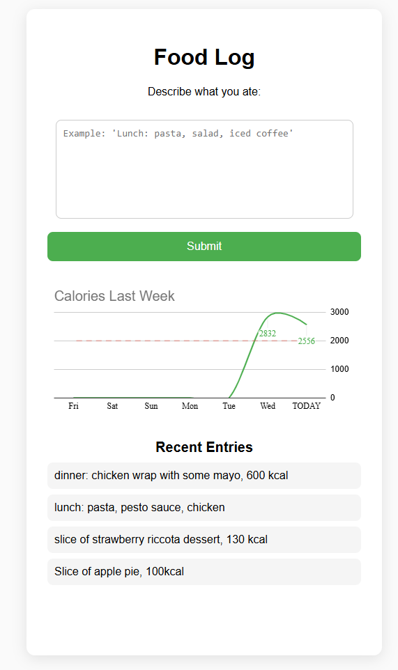

# Food Log (AI-Powered)

A small, lightweight tool for logging what you eat.  
You type a natural-language description (“oatmeal, banana, cappuccino”), and the system:

- sends it to a Google Apps Script backend  
- uses OpenAI to break it into individual food items  
- estimates kcal, protein, carbs, and fats  
- stores each item as a separate row in Google Sheets  
- displays recent entries synced from the sheet  

Everything runs on free services: Cloudflare(/GitHub Pages) + Google Apps Script + Google Sheets.

| Description | Preview |
|------------|---------|
|  
## Why This Is Useful  
- Fast food tracking: just type what you ate, no menus or dropdowns.  
- AI handles splitting foods and estimating macros.  
- All entries sync across phone and laptop automatically.  
- No servers, no databases, no frameworks.  
- Fully private: OpenAI key stays inside Apps Script, never exposed to the frontend.  
- Good, low effort way of tracking calories approximatelly. Good for people who want to start counting calories with minimal engagement.  
- Easy to extend for nutrients, allergens, FODMAPs and more.  
|  
  
|

## How to Set It Up Yourself

1. Create a Google Sheet  
   Add a sheet named `Sheet1` with columns:

   date | time | meal | description | amount | kcal | protein | carbs | fats

2. Add the Apps Script backend  
   Open Extensions → Apps Script in your sheet.  
   Copy the contents of `deployment_apps_script_example.gs` into the editor.  
   Insert your OpenAI key.  
   Make sure both doPost and doGet functions are present.

3. Deploy the Script as a Web App  
   Deploy → New Deployment → Web App  
   Execute as: Me  
   Who has access: Anyone  
   Copy the /exec URL.

4. Update the Frontend  
   In index.html, set:
   const ENDPOINT = "YOUR_EXEC_URL_HERE";

5. Host (I'm using Cloudflare Pages, since it can be used to host a private repo, to avoid spam).   
   Place index.html and README.md in a repository.  
   Share it to Cloudflare pages.  
   Open the URL on your phone or laptop.

---

## Files
- index.html  
- deployment_apps_script_example.gs  
- README.md
- favicon.png
- share-image.png

A simple, practical way to track meals using nothing but a browser, a Google Sheet, and a bit of AI.

